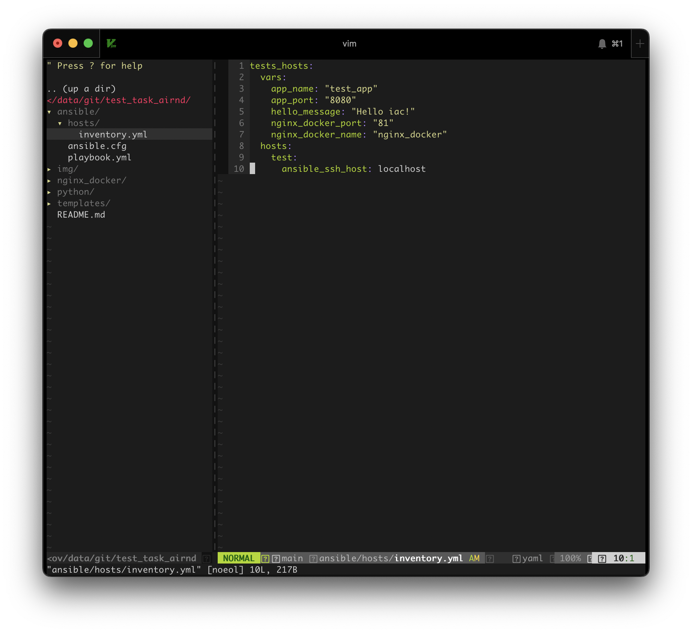
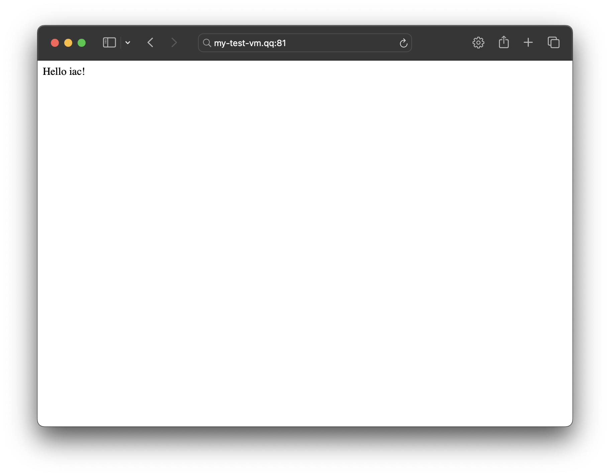
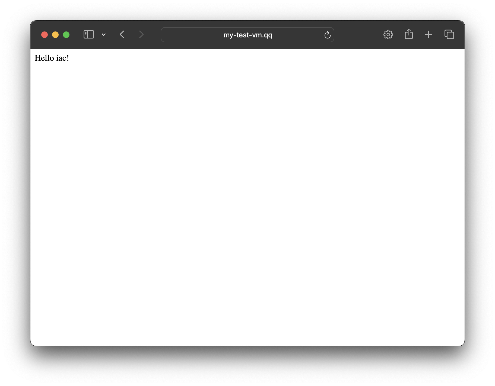

# Запуск приложения и веб-сервера nginx 

> Для корректной работы убедитесь, что у вас установлен Ansible модуль community.docker
> 
> Проверьте командой `ansible-galaxy collection list`
> 
> В случае отсутсвия установите `ansible-galaxy collection install community.docker`


Дерево репо
```
.
├── README.md
├── ansible
│   ├── ansible.cfg
│   ├── hosts
│   │   └── inventory.yml
│   ├── playbook.yml
│   └── roles
│       └── ansible-role-loadbalancer
│           ├── README.md
│           ├── defaults
│           │   └── main.yml
│           ├── files
│           ├── handlers
│           │   └── main.yml
│           ├── meta
│           │   └── main.yml
│           ├── tasks
│           │   └── main.yml
│           ├── templates
│           │   └── nginx.conf.j2
│           └── vars
│               └── main.yml
├── img
│   ├── screen_browser-80.png
│   ├── screen_browser-81.png
│   └── screen_cli.png
├── nginx_docker
│   ├── 00-jsonlog.conf
│   ├── Dockerfile
│   └── nginx.conf
├── python
│   ├── Dockerfile
│   ├── app.py
│   └── requirements.txt
└── templates
    ├── docker-compose.yaml.j2
    └── front.conf.j2
```

`ansible` - директория с конфигурацией ансибла, файлом с инвентарем и плейбуком по установке пакетов и запуск приложения и сервса

> Необходимо в файле инвентаря изменить `localhost` на ваш ip адрес, где вы хотите развернуть данный сервис
> 

`nginx_docker` - директория с Dockefile и конфигами для образа Nginx

`python` - директория с Dockefile и приложением

`templates` - директория с шаблонами конфигураций для корректного запуска


В файле инвентаризации вы можете изменить значения переменных для проекта, такие как имя контейнера с сервисом, порты контейнеров, приветственное сообщение и тп


Представлено два способа развертывания Nginx 
1. Nginx в контейнере
2. Nginx сервис 

Для тестировании определенного способа необходимо в файле инвентаря в переменной `nginx_as_service` указать `true` или `false`

`true` - установит nginx сервис 

`fasle` - разверенет nginx в контейнере

## Первый вариант. Nginx в контейнере

В Файле инвентаря устанавливаем значение для переменной `nginx_as_service: false` 

```yaml
tests_hosts:
  vars:
    app_name: "test_app"
    app_port: "8080"
    hello_message: "Hello iac!"
    nginx_as_service: false
    nginx_conf: "front.conf.j2"
    nginx_docker_port: "81"
    nginx_docker_name: "nginx_docker"
  hosts:
    test:
      ansible_ssh_host: localhost
```

В этом случае в файле docker-compose.yaml применится блок с развертыванием nginx в контейнере

Для запуска перейдем в директорию `ansible` и запустим плейбук

```bash
~ > cd ansible
~ > ansible-playbook playbook.yml
```

В выводе мы увидим завершенные таски и состояние контейнеров после запуска

Перейдем по ссылке http://<your_ip_address>:81 и увидим




## Второй вариант. Nginx сервис

В Файле инвентаря устанавливаем значение для переменной `nginx_as_service: true`

```yaml
tests_hosts:
  vars:
    app_name: "test_app"
    app_port: "8080"
    hello_message: "Hello iac!"
    nginx_as_service: true
    nginx_conf: "front.conf.j2"
    nginx_docker_port: "81"
    nginx_docker_name: "nginx_docker"
  hosts:
    test:
      ansible_ssh_host: localhost
```

В этом случае в файле docker-compose.yaml применятся блок с развертыванием nginx в контейнере не будет

А запустится ansible роль с установкой сервиса nginx и изменением шаблона конфигурации для нашего сервиса

Запустим плейбук

```bash
~ > ansible-playbook playbook.yml
```

Перейдем по ссылке http://<your_ip_address> и увидим (обратите внимание, мы используем стандартный 80 порт)


