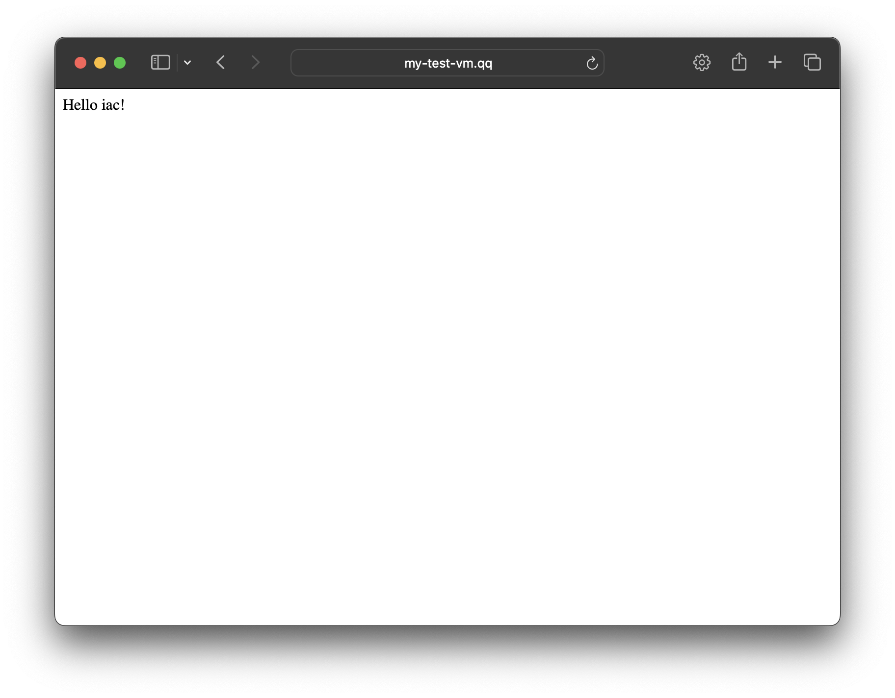

# test_airnd
### Запуск приложения и веб-сервера nginx 

> Для корректной работы убедитесь, что у вас установлен Ansible модуль community.docker
> 
> Проверьте командой `ansible-galaxy collection list`
> 
> В случае отсутсвия установите `ansible-galaxy collection install community.docker`
 


Представлено два способа развертывания Nginx 
1. Nginx в контейнере
2. Nginx как сервис 

Рассмотрим первый вариант

Дерево репо 
```
.
├── README.md
├── ansible
│   ├── ansible.cfg
│   ├── hosts
│   │   └── inventory.yml
│   └── playbook.yml
├── nginx_docker
│   ├── 00-jsonlog.conf
│   ├── Dockerfile
│   └── nginx.conf
├── python
│   ├── Dockerfile
│   ├── app.py
│   └── requirements.txt
└── templates
    ├── docker-compose.yaml.j2
    └── front.conf.j2
```

`ansible` - директория с конфигурацией ансибла, файлом с инвентарем и плейбуком по установке пакетов и запуск приложения и сервса

> Необходимо в файле инвентаря изменить `localhost` на ваш ip адрес, где вы хотите развернуть данный сервис
> 

`nginx_docker` - директория с Dockefile и конфигами для образа Nginx 

`python` - директория с Dockefile и приложением

`templates` - директория с шаблонами конфигураций для корректного запуска 


В файле инвентаризации вы можете изменить значения переменных для проекта, такие как имя контейнера с сервисом, порты контейнеров, приветсвенное сообщение и тп

Для запуска перейдем в директорию `ansible` и запустим плейбук

```bash
~ > cd ansible
~ > ansible-playbook playbook.yml
```

В выводе мы увидим завершенные таски и состояние контейнеров после запуска

Перейдем по ссылке http://<your_ip_address>:81 и увидим



